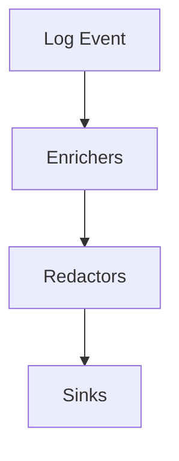

# Fapilog Primer: High-Level Guide

## What is Fapilog?

Fapilog is a robust, extensible logging framework designed for modern Python applications, with first-class support for FastAPI. It enables structured, high-performance logging with advanced features such as enrichment, redaction, and flexible output sinks. Fapilog helps teams capture, process, and route logs efficiently for observability, debugging, and compliance.

**See also:** [Quickstart](quickstart.md), [User Guide](user-guide.md), [API Reference](api-reference.md)

---

## Core Concepts

### Logging Pipeline

Fapilog processes log events through a configurable pipeline:

1. **Enrichers** add context (e.g., request info, user data).
2. **Redactors** remove or mask sensitive data.
3. **Sinks** output logs to destinations (files, stdout, Loki, etc.).

**See also:** [API Reference](api-reference.md), [User Guide](user-guide.md#core-concepts), [Config](config.md)

### Sinks

Sinks are output targets for logs. Fapilog supports multiple sinks, including files, stdout, and remote log aggregators like Loki.

### Enrichers

Enrichers automatically add useful metadata to each log event, such as request IDs, user context, or resource usage.

### Redactors

Redactors ensure sensitive information (PII, secrets) is masked or removed before logs are output.

---

## Typical Workflows

### 1. Basic Setup

- Install Fapilog and configure it in your FastAPI app.
- Define enrichers and redactors as needed.
- Choose and configure sinks for your environment.

### 2. Logging Events

- Use standard logging calls (`logger.info`, `logger.error`, etc.).
- Fapilog automatically processes and routes logs through the pipeline.

### 3. Observing Logs

- View logs in your chosen sink (console, file, or log aggregator).
- Use structured fields for filtering and analysis.

**See also:** [Quickstart](quickstart.md), [Examples](../examples/), [User Guide](user-guide.md#tutorials)

---

## Example Pipeline Diagram

**See also:** [Core Concepts](user-guide.md#core-concepts), [Quickstart](quickstart.md)

---

## Learn More

- [User Guide](user-guide.md)
- [API Reference](api-reference.md)
- [Configuration Guide](config.md)
- [Tutorials](user-guide.md#tutorials)
- [Core Concepts](user-guide.md#core-concepts)
- [Style Guide](style-guide.md)

**See also:** [Style Guide](style-guide.md), [User Guide](user-guide.md), [Config](config.md)

---

## Next Steps

- Read the [User Guide](user-guide.md) for hands-on tutorials.
- Explore the [API Reference](api-reference.md) for details on configuration and usage.
- Review the [Style Guide](style-guide.md) for documentation standards.
